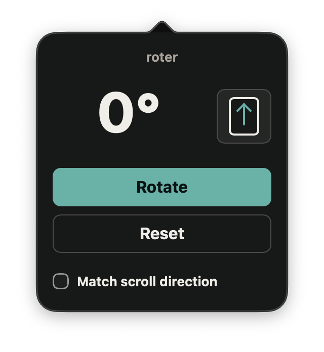

<div align="center">

# Roter

**Rotate your current Safari tab like a tablet.**


</div>

Roter is a macOS Safari Web Extension for reading portrait-first pages inside a landscape browser window. It rotates the current page in place, keeps the state scoped to the current tab and site, and asks for website access only when you use it on that site.


## Highlights

- Rotate the current tab through a full `0 -> 90 -> 180 -> 270 -> 0` cycle.
- Reset the page back to normal with one click.
- Request permission site by site, then remember granted sites through Safari.
- Keep rotation within the same site and current tab.
- Show the current angle and direction in the toolbar popup.
- Optionally match scroll input to the rotated orientation.

## Screenshots

| Popup | Rotated page |
| --- | --- |
|  |  |

## Quick Start

Basically, since I don't want to pay the Apple tax, you have to build this yourself. It's very easy to do so, and you are welcomed to distribute this app if you wish.

### Requirements

- macOS with Safari
- Xcode

### Build and Run

1. Open the project in Xcode:

   ```sh
   open roter/roter.xcodeproj
   ```

2. Open Safari and enable unsigned extensions: 
    `Safari -> Settings -> Developer -> Allow unsigned extensions`

3. Select the `roter` scheme and run the app.

### Command-Line Build

```sh
xcodebuild -project roter/roter.xcodeproj -scheme roter -configuration Debug build
```

### Tests

You need:
- Node.js and npm for JavaScript tests
- Docker for the browser-based end-to-end test

```sh
npm run test:unit
npm run test:e2e:docker
```

`npm run test:unit` runs the JavaScript unit tests. `npm run test:e2e:docker`
builds a temporary Chromium-compatible copy of the extension and verifies the
rotation flow in Playwright.


## Permissions

The extension declares `<all_urls>` as an optional host permission so it can work
on arbitrary websites, but it does not request broad access up front. When you
use Roter on a site, it requests access for that current site only. Safari then
remembers the granted site permission.

Unsupported pages such as `about:blank`, browser UI pages, and non-web URLs are
left alone.
